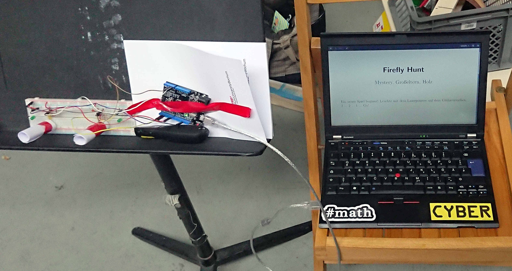
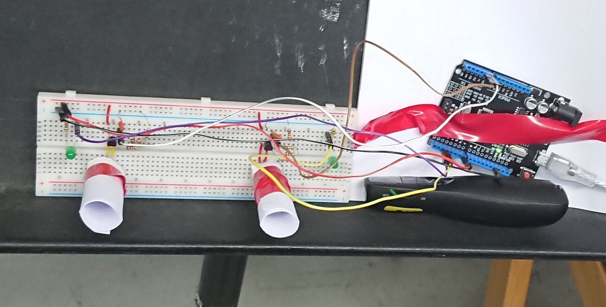
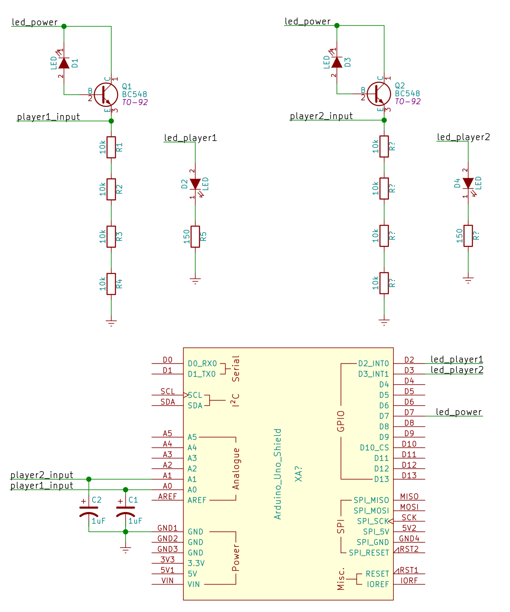

# Firefly hunt
Firefly hunt ist ein kleines Spiel, welches beim [mini game jam Dortmund](https://game-jam-do.de/) entwickelt wurde. Das Ziel des Spiels ist es, Glühwürmchen zu fangen. Dazu muss mit einem Laserpointer auf eine LED gezeigt werden. Wer die LED als erstes mit der nötigen Intensität trifft, hat gewonnen.

Zu Beginn wird ein Referenzwert gemessen, der von der Beleuchtung der Umgebung abhängt. Anschließend leuchten die Spieler-LEDs drei Mal kurz auf und das Spiel beginnt. Trifft ein Spieler seine Sensor-LED, so leuchtet die jeweilige Spieler-LED für drei Sekunden. Die verstrichene Zeit wird ausgegeben und das Spiel startet erneut.

## Schaltung
Für die Erkennung des Laserpunktes wurde eine LED verwendet. Normalerweise sind LEDs dazu da, um Licht zu erzeugen. In diesem Fall wied die LED verwendet, um Licht zu "messen". 

Damit das funktioniert, wird eine LED in Sperrrichtung betrieben. Dadurch fließt ein minimaler Sperrstrom. Der Sperrstrom wird von einem Transistor verstärkt. Die Spannung zwischen Emitter und Masse kann von den analogen Eingängen des Arduinos gemessen werden. Dazu wurde eine Reihenschaltung aus mehreren größeren (10 kΩ) Widerständen aufgebaut, an denen die Spannung abfällt. Je größer die Widerstände, umso besser. Wir hatten leider keine größeren Widerstände dabei. Mit den Kondensatoren wird die analoge Spannung etwas geglättet.

Um den Einfluss von Streulicht zu verringern, wurden kleine Papierrollen gebaut, in denen die LEDs sind.

## Quelltext
Es gibt eine Singleplayer-Vairante und eine Multiplayer-Variante:
- [firefly_hunt_single.ino](firefly_hunt_single.ino)
- [firefly_hunt_multi.ino](firefly_hunt_multi.ino)

## LaTex-Ausgabe
Ein besonderes Highlight ist die Ausgabe der Spielergebnisse in einer PDF-Datei. Der Arduino sendet die Ergebnisse über die serielle Schnittstelle. Diese Ausgaben werden genutzt um ein LaTex-Dokument zu generieren, woraus mit pdflatex ein PDF-Dokument erzeugt wird. 

Im Ordner [latex_ausgabe](latex_ausgabe) befindet sich das Skript, welches
auf einer seriellen Schnittstellen auf neue Werte wartet, um das PDF
zu erzeugen. Auch ein Beispieldokument ist dort zu finden.
